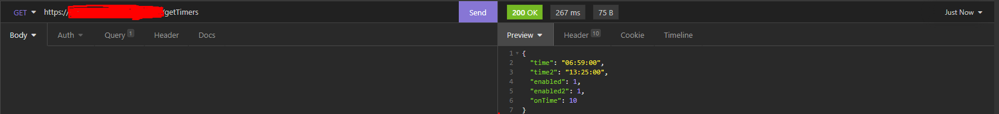

**Things needed to get this API running**

You need certifacate if you want ssl to work with Nginx. You can get free SSL certificate from [Cloudflare](https://www.cloudflare.com/). Even though its not needed for this API to work it is recommended to use HTTPS. You need SQL server and you need to store those credentials in .env file. Also you need to create an API_KEY that will be compared against clients key. Also there are docker files for you to get to work in docker container. Also you need a server to host this. I found mine on [LowEndTalk](https://lowendtalk.com/).

---

## Edit .env file

These need to be edited:

```
DB_HOST=IPADDRESS
DB_USERNAME=USERNAME
DB_PASSWORD=PASSWORD
DB_DATABASE=DATABASE

API_KEY=SECRET_API_KEY
```

---

## Edit nginx.conf file in reverse_proxy folder

Also these:
```
ssl_certificate
ssl_certificate_key

server_name
```
---

## Here you can get your SSL certificates from Cloudflare


## Endpoints (GET and POST)

All of these enpoints require an *api_key*. Except /robots.txt because it is intended for crawling bots like the one that Google uses.

These are the **GET** endpoints:
```
/robots.txt
/getTimers
/getStatus/:id
/getLocation
/getTemp
/getVoltage
/refreshLogs
```
And these are the **POST** endpoints:
```
/updateTimers
/updateStatus/:id
/updateLocation
/updateTemp
/updateVoltage
/updateLogs
```
---
## Usage

GET example request: http://sub.domain.tld/getTimers?api_key=secret_api_key.
This will return formatted JSON like this:
```
{
	"time": "06:59:00",
	"time2": "13:25:00",
	"enabled": 1,
	"enabled2": 1,
	"onTime": 10
}
```


POST example request: http://sub.domain.tld/updateVoltage
and in the request body:

```
{
	"api_key":"secret_api_key",
	"voltage":"0"
}
```


## Status codes

```
200 OK - if the request was successful
201 Created - if the request was successful and data was added to the database
400 Bad request - if one or more of the required arguments are missing
401 Unauthorized - if the api_key doesn't match servers key 
```